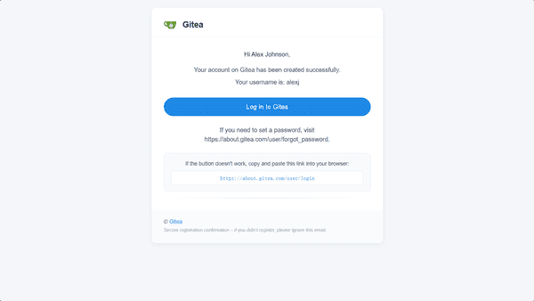
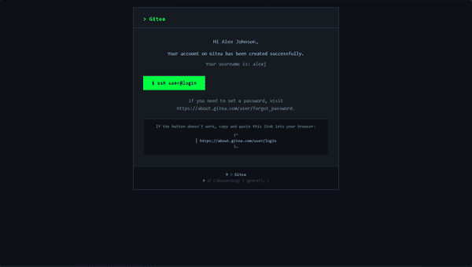
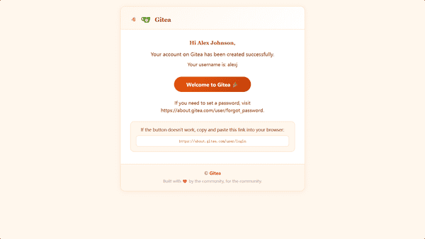
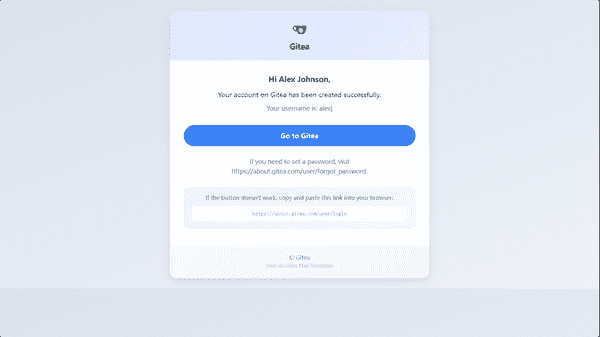
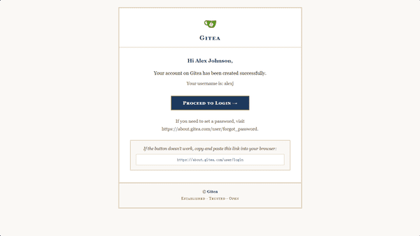
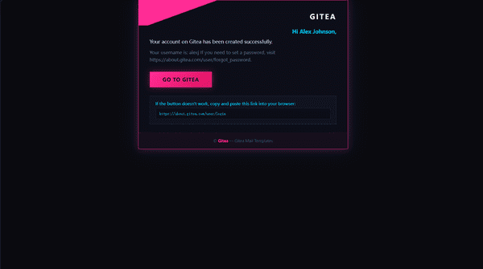
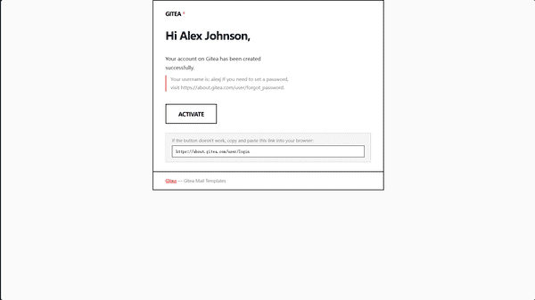
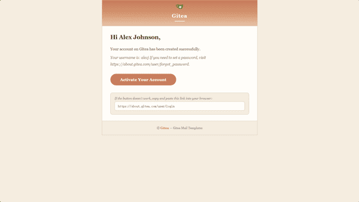
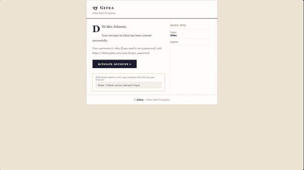
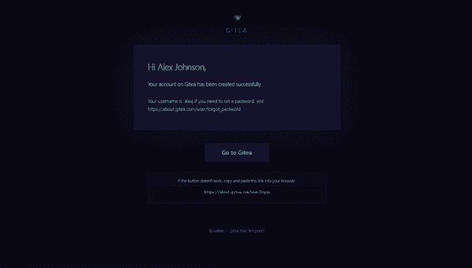

# Gitea 郵件模板

為自託管 [Gitea](https://about.gitea.com) 實例精心設計、面向不同受眾的郵件模板集合。

> **110 個模板檔案 — 10 種視覺風格，每種 11 種郵件類型**

---

## 設計理念

大多數自託管 Gitea 實例使用預設的純文字郵件模板。本專案提供了**開箱即用、視覺精美的替代方案**——每種方案都針對特定社群或受眾設計，您可以選擇最適合您使用者的風格。

每個模板都是直接替換。所有 Go 模板變數、翻譯鍵和 Gitea 資料上下文完全相容。**無需修補程式、無需外掛、無需 fork。**

---

## 風格展示

| 預覽 | 風格 | 受眾 | 特點 |
|---|---|---|---|
|  | **Horizon** | 企業/公司 | 藍色強調色、石板灰排版、居中卡片 |
|  | **Terminal** | 開發者/技術 | 暗色模式、等寬字型、綠色命令列風格 |
|  | **Ember** | 社群/開源 | 暖琥珀色、圓角、人文主義、包容 |
|  | **Bloom** | 創意/新創 | 磨砂玻璃、柔和藍色光線、虹彩點綴 |
|  | **Heritage** | 教育/研究 | 海軍藍與金色、襯線字型、經典、權威 |
|  | **Neon** | 遊戲/Web3/創意科技 | 賽博龐克霓虹、粉紅與青色、合成波能量 |
|  | **Mono** | 設計工作室/編輯 | 瑞士粗野主義、黑白紅強調、零圓角 |
|  | **Terra** | 永續/健康 | 溫暖大地色調、有機質感、人文襯線 |
|  | **Ink** | 出版/新聞/文學 | 編輯印刷、深藍與金色、報紙排版 |
|  | **Aurora** | 高端SaaS/正念 | 空靈光效漸變、深紫與青綠、大氣光暈 |

> 圖片為 600px 寬截圖，來自[線上預覽](../preview/index.html)。截圖方法參見 [images/README.md](images/README.md)。

[**線上預覽展示**](../preview/index.html)

---

## 安裝

選擇一種風格，將 `mail/` 目錄複製到 Gitea 自訂模板路徑：

```bash
cp -r themes/horizon/mail/* /var/lib/gitea/custom/templates/mail/
systemctl restart gitea
```

切換風格只需覆蓋檔案，無需更改設定。

### 確認生效

管理後台的測試郵件不會使用自訂模板。要驗證模板是否生效，請觸發一次真實的
郵件通知。最快的方式是密碼重設：登出帳號，點擊登入頁的**"忘記密碼"**，查看
重設郵件即可——它將使用你的自訂樣式渲染。

---

## 預覽

**靜態模式：**
```bash
cd tools && go run . preview all
```
然後開啟 `preview/index.html`。

**開發伺服器（即時重載）：**
```bash
cd tools && go run . dev 
# → http://localhost:3456
```


---

## 相容性

- **Gitea 1.25+** — v1.25 引入的郵件模板目錄結構
- **最新測試：** Gitea 1.26.4<!-- TRACKER:LATEST-TESTED -->
- 與 Gitea 官方模板 100% 相容 — 詳見 [COMPATIBILITY.md](COMPATIBILITY.md)

## 授權

MIT — 詳見 [LICENSE](../LICENSE)。
